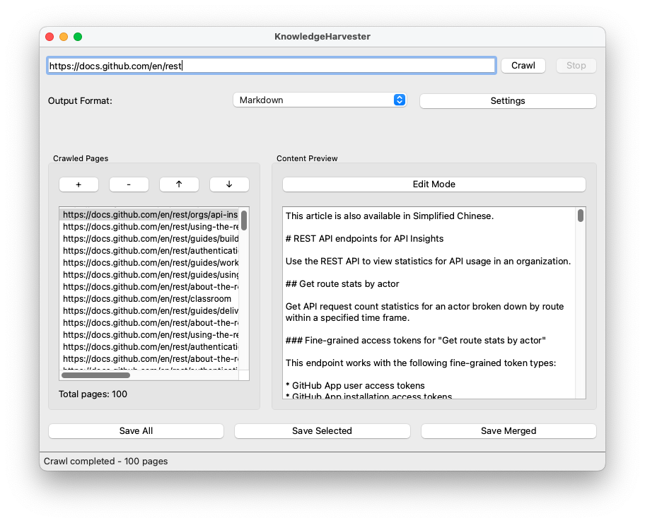

# KnowledgeHarvester

KnowledgeHarvester is a GUI-based tool for crawling documentation from websites, such as API docs or other manuals, and saving them locally in Markdown or JSON formats that are AI-friendly.



## Requirements

- Python 3.11 or higher
- Operating system: Windows/macOS/Linux

## Installation

1. Clone the repository:
```bash
git clone https://github.com/jin-taiyu/KnowledgeHarvester.git
cd KnowledgeHarvester
```

2. Create and activate a virtual environment:
```bash
conda create -n KnowledgeHarvester python=3.11
conda activate KnowledgeHarvester
```

3. Install dependencies:
```bash
pip install -e .
```

## Usage

1. Launch the application:
```bash
knowledge-harvester
```

2. Enter the URL you want to crawl in the address bar

3. Select the output format (Markdown or JSON)

4. Click "Crawl" to start crawling

5. Review the results in the preview window

6. Click "Save" to store them locally

## Configuration

### Crawler Settings

- JavaScript Support: Enable/Disable JavaScript rendering
- Wait Time: Configure wait time for dynamic content to load
- Proxy Settings: Set up HTTP/HTTPS proxies
- Request Headers: Customize user agent or other headers

### Storage Settings

- Storage Path: Specify the save location
- Directory Structure: Organize files by domain/date
- File Naming: Configure file name prefixes/suffixes

## Project Structure

```
KnowledgeHarvester/
├── src/
│   ├── crawler/               # Crawler module
│   │   ├── base.py            # Base crawler implementation
│   │   ├── filters.py         # Content filters
│   │   └── formatters.py      # Format converters
│   ├── gui/                   # GUI module
│   │   ├── main_window.py     # Main window
│   │   └── settings_dialog.py # Settings dialog
│   ├── storage/               # Storage module
│   │   └── local_storage.py   # Local storage implementation
│   ├── __init__.py
│   └── __main__.py            # Application entry point
├── requirements.txt           # Project dependencies
└── setup.py                   # Installation script
